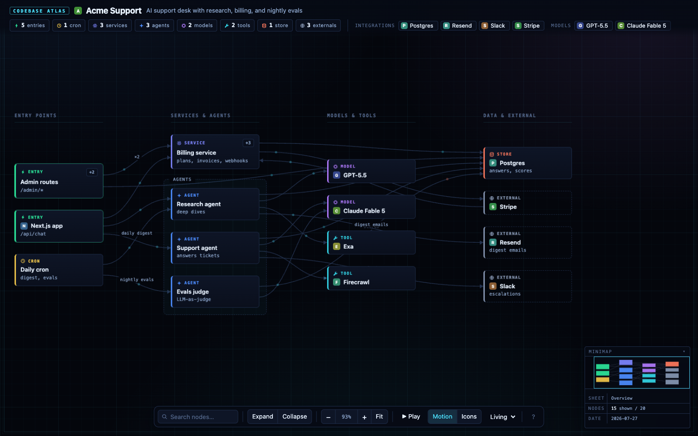
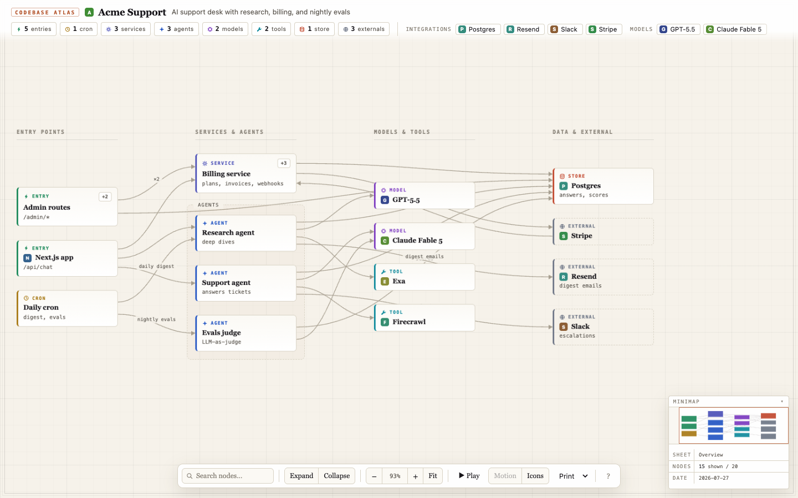

# atlas

Your coding agent analyzes a repository and produces a beautiful, interactive
map of how the codebase works — entry points, crons, services, datastores, and
integrations, plus the AI layer (agents, models, tools) when the repo has one.

**Nothing is uploaded anywhere**: no account, no service, no sign-in. The agent
writes a small `atlas.json`, and the bundled renderer turns it into a single
self-contained HTML file that works offline from `file://` and makes zero
network requests unless you switch icons on:

```bash
python3 atlas/scripts/render.py .atlas/atlas.json --open
```





The viewer supports:

- **two themes**: `living` (the animated near-black default) and `print` (a
  bright editorial light theme for embeds and printing), switchable from the
  toolbar or with `--theme`; paper output always uses the print theme
- **living motion**: flow particles travel along each edge in flow direction
  (color-coded by read/write/call), entry points pulse, and a **Play** button
  runs a guided tour that auto-walks each entry point's flow. Motion honors
  `prefers-reduced-motion`, has a Motion off-switch, and is always off in print

- **semantic lanes**: nodes are arranged in labeled columns — Entry points →
  Services & agents → Models & tools → Data & external — so horizontal position
  always means the same thing, and externals render as dashed outlines
  (outside the system boundary)
- **kind glyphs**: every node and stat pill carries a small
  inline-SVG shape per kind (bolt, gear, spark, cylinder, globe, …) — legible
  when zoomed out, a second channel besides color, zero network requests
- **"Ask agent…"**: click any node and get a ready-made prompt for your coding
  agent, preloaded with that node's summary, source path, contents, and every
  connection it has (including the ones its children own) — with a toggle to
  widen the context to the node's whole upstream/downstream flow. Type your
  question at the end and copy. Turns "what is this box?" into a real task
  handoff without re-explaining the architecture
- pan / zoom (wheel and +/− buttons), a live zoom readout that resets to 100%
  on click, fit-to-screen, and a collapsible minimap that draws the edges too,
  dims the off-screen map around your viewport, and takes the aspect ratio of
  the layout — click or drag it to move the camera
- flow tracing on hover (full upstream + downstream path highlighted, edge
  kinds revealed)
- **focus mode**: double-click any node to isolate its entire flow on a clean
  canvas; expand containers while focused to drill into just that flow
- **two-level drill-down**: the top level is the whiteboard overview; any node
  can be a container that expands in place — with animated relayout — to its
  full contents (every route, admin section, schema cluster, agent tool);
  edges re-route and merge automatically when a container is collapsed
- click-for-detail popovers with a one-line description, the container's
  contents, Focus/Ask-agent/Expand actions, and a `sourceRef` jump-to-code path
- fanned edge anchors so hub nodes with many connections stay legible
- labeled group stacks ("Billing", "Ingestion", …)
- always-visible edge labels for business logic ("charges on trial end")
- **clickable header**: the kind pills carry the glyph, colour, name and count
  for each kind and double as the per-kind filter (everything else dims — "show
  me just the services"); integration/model chips jump the camera to their node
- search (matches hidden children too), and a `?` popover in the toolbar with
  the gestures and keyboard shortcuts
- **remembered view settings**: theme, Motion, Icons and the minimap's
  collapsed state survive a reload. They are stored per map (all local files
  share one `file://` origin, so a global key would leak your settings into a
  map someone sent you — and silently switch its favicon fetching on). The
  rendered `--theme` / `--online-icons` config stays the default until you
  actually touch that control; if storage is unavailable the viewer just stops
  remembering

The skill treats completeness as a discipline: it writes a coverage inventory to
`.atlas/inventory.md` (every dependency, env var, route, scheduled job, schema
file, flag-driven mode, tool) and reconciles the map against it line by line, so
drill-down containers can account for everything the top-level overview
summarizes — a repeatable method for "did it cover everything," rather than a
machine-checked guarantee.

The data contract is versioned: `version: 1` files still render correctly, and
`version: 2` adds the `parent` field for drill-down hierarchy (up to 300 nodes
total, ≤40 in the top-level overview).

Try the demo:

```bash
python3 atlas/scripts/render.py atlas/examples/demo.json -o /tmp/demo.html --open
```

Validate without writing:

```bash
python3 atlas/scripts/render.py .atlas/atlas.json --check
```

`--check` also verifies that every `sourceRef` resolves to a file that really
exists, reporting e.g. `190/191 sourceRefs resolve` — so a jump-to-code link the
agent guessed at surfaces as a warning instead of as a dead link someone finds
weeks later. It goes one step further and checks that the line is worth jumping
to: a ref landing on a doc comment, a blank line, a bare `const (`, or its own
parent's line gets flagged with the line to use instead, because that is what a
line number inferred from nearby context looks like. The repo root is inferred
from the `<repo>/.atlas/atlas.json` layout; pass `--repo PATH` if the atlas
lives elsewhere, or `--no-source-check` to skip.

It also reports the top-level node count (the number the caps are about, not
just the total), and warns when more than one edge in four carries a label —
labels never fade, so past that density the map opens as a thicket of text.

What `--check` deliberately does *not* claim to verify is edges. An edge is
structurally valid as long as both ends are node ids, so a clean validation run
says nothing about whether "billing writes to Postgres on trial end" is true.
So it prints the labelled edges as a worklist and ends by naming how many of
them assert behaviour on your word alone; the skill makes confirming each one at
a call site a required step rather than a suggestion. Across a 7-repo blind
evaluation, three quarters of the wrong edges were off by exactly one hop — the
caller, the callee, or a sibling in the same directory — and every one of them
looked correct from the import block.

Reconcile the coverage inventory against the map:

```bash
python3 atlas/scripts/render.py .atlas/atlas.json --check --inventory
```

This reads the dispositions the inventory wrote back at itself ("node `x`",
"child `y`", "detail on `z`"), checks each id exists, and flags any item that
names nothing and was never marked omitted — reporting e.g. `inventory: 83 items
— 73 mapped, 10 omitted, 0 unreconciled`. Without it, the agent that wrote both
files is also the one grading whether they agree.

Install with:

```bash
npx skills add YiftachCohen/skills --skill atlas
```

Requires only Python 3 (stdlib). Favicons are opt-in and off by default — the
viewer shows letter tiles until you enable the toolbar "Icons" toggle (or render
with `--online-icons`), which fetches favicons from google.com. With icons off,
opening the file makes no network requests at all.
